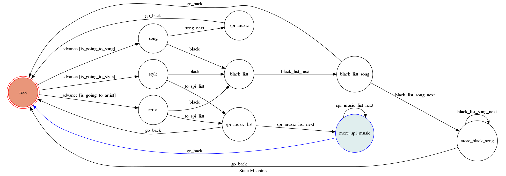
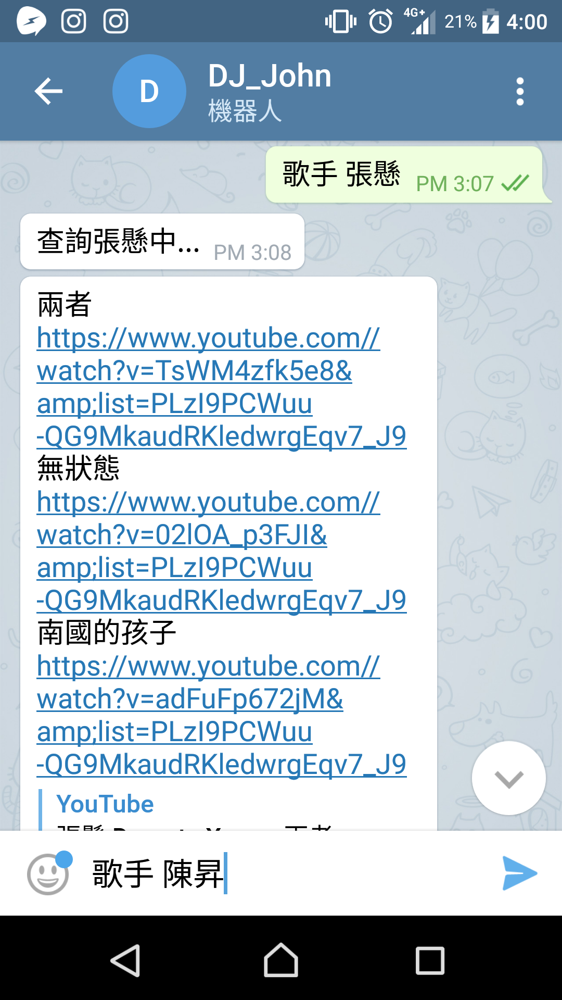

# DJ_John 

A telegram bot based on finite state machine

and use the template code form TOC Project 2017

主要功能為簡單的音樂搜尋


## Setup

### Prerequisite
* Python 3

#### Install Dependency
```sh
pip install -r requirements.txt
```

* pygraphviz (For visualizing Finite State Machine)
    * [Setup pygraphviz on Ubuntu](http://www.jianshu.com/p/a3da7ecc5303)


### Run Locally
You can either setup https server or using `ngrok` as a proxy.

**`ngrok` would be used in the following instruction**

```sh
ngrok http 5000
```

After that, `ngrok` would generate a https URL.

Set `WEBHOOK_URL` (in app.py) to `your-https-URL/hook`.


#### Run the sever

注意要修改app,py中的WEBHOOK_URL以及API_TOOKEN

```sh
sudo python3 app.py
```

## Finite State Machine



## How to talk to the bot?
- 查詢類別：歌手/歌曲/風格
- 查詢內容：使用這自訂義

可以輸入：
`[查詢類別] [查詢內容]`

e.g.
歌手 張懸
歌手 greenday
風格 爵士
風格 搖滾


或者輸入：
`[查詢類別] [否定詞] [查詢內容]`

e.g. 歌手 不要 周杰倫


